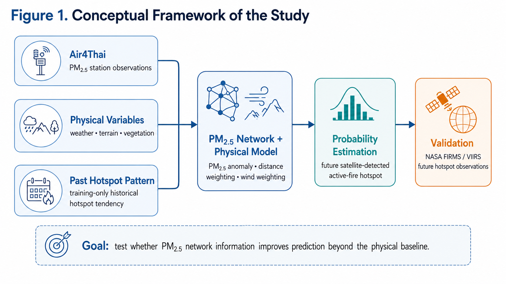
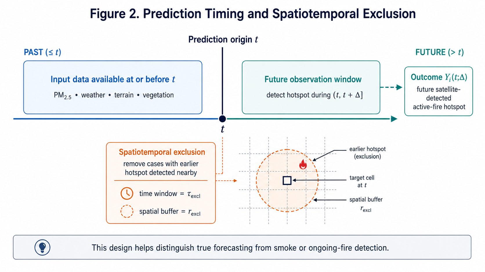
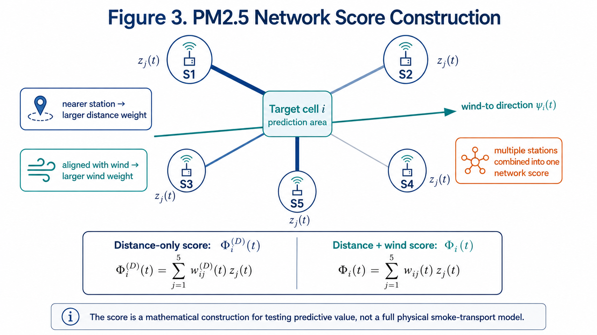
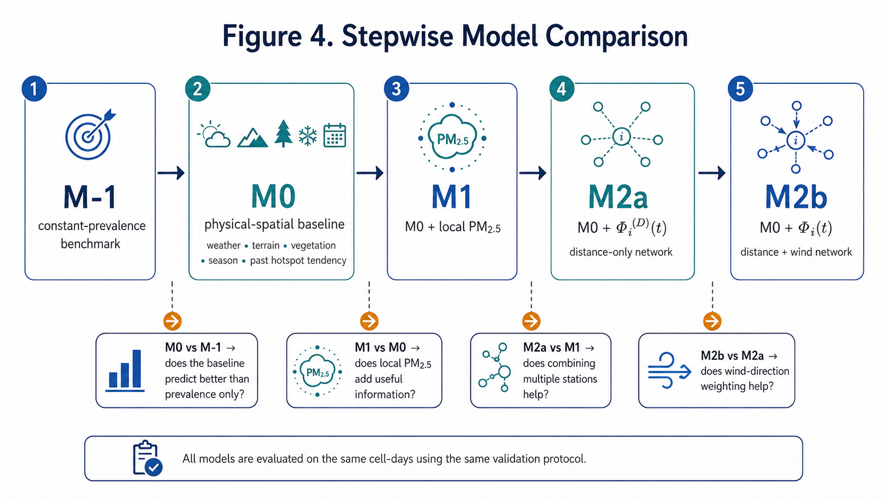
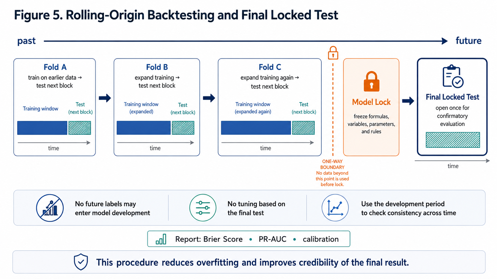

# BLUEPRINT โครงงาน YSC 2027

## การพัฒนาแบบจำลองเชิงคณิตศาสตร์จากเครือข่าย PM2.5 เพื่อประมาณความน่าจะเป็นเชิงพื้นที่และเวลาของจุดความร้อนจากไฟที่ตรวจพบในอนาคต

**ชื่อภาษาอังกฤษ (Official Title):**  
**Development of a PM2.5 Network-Based Mathematical Model for Spatiotemporal Probability Estimation of Future Active-Fire Hotspots**

**การประกวด:** การประกวดโครงงานของนักวิทยาศาสตร์รุ่นเยาว์ ครั้งที่ 29 (YSC 2027)  
**สาขาที่ส่งประกวด:** คณิตศาสตร์และสถิติ (Mathematics and Statistics, MA)  
**สาขาย่อย:** คณิตศาสตร์ประยุกต์และเชิงคำนวณ (Applied and Computational Mathematics, MAAP)  

**คณะผู้พัฒนาโครงงาน (นักเรียนชั้นมัธยมศึกษาปีที่ 4 โรงเรียนห้องสอนศึกษา ในพระอุปถัมภ์ฯ จังหวัดแม่ฮ่องสอน):**
1. นางสาวพีชญา สุธรรม
2. นางสาวพนิดา นันทภัทร
3. นางสาวฟ้าใส มุ่งศรีโสภณ

**อาจารย์ที่ปรึกษา (โรงเรียนห้องสอนศึกษา ในพระอุปถัมภ์ฯ จังหวัดแม่ฮ่องสอน):**
1. นายสาธิต ศิริวัชน์ (อาจารย์ที่ปรึกษาหลัก — ฟิสิกส์และการประยุกต์เทคโนโลยีดิจิทัล)
2. นางสาวพรไพลิน ตาใฝ (อาจารย์ที่ปรึกษาร่วม — คณิตศาสตร์และการพัฒนาโครงงาน)

---

# 1. บทสรุปและแนวคิดหลักของโครงงาน (Executive Summary)

โครงงานนี้ศึกษาปัญหาทางคณิตศาสตร์และสถิติประยุกต์ว่า

> **เมื่อควบคุมปัจจัยพื้นฐานด้านกายภาพ (สภาพอากาศ ภูมิประเทศ พืชพรรณ ฤดูกาล) และแนวโน้มความเสี่ยงเดิมของแต่ละพื้นที่ในอดีตแล้ว รูปแบบเชิงพื้นที่และเวลาจากเครือข่ายตรวจวัด PM2.5 (ค่าความผิดปกติ การรวมหลายสถานีตามระยะทาง และการให้น้ำหนักตามทิศทางลม) จะช่วยเพิ่มความสามารถในการประมาณความน่าจะเป็นของการพบจุดความร้อนจากไฟ (Active-Fire Hotspots) ที่ดาวเทียมจะตรวจพบในอนาคต ($\Delta = 24\text{ ชั่วโมง}$) หรือไม่?**

หัวใจของโครงงาน **ไม่ใช่การสร้างฮาร์ดแวร์เซนเซอร์ตรวจวัดฝุ่น และไม่ใช่การแข่งขันสร้างโมเดล Machine Learning แบบกล่องดำ (Black-box ML)** แต่คือการสร้าง **แบบจำลองทางคณิตศาสตร์และสถิติ (Mathematical & Statistical Modeling)** ที่โปร่งใส ตีความได้ และตรวจสอบสมมติฐานได้อย่างเป็นระบบ ได้แก่

1. **Mathematical Feature Construction:** นิยามค่าความผิดปกติของ PM2.5 ที่ทนทานต่อค่าผิดปกติ ($z_j(t), a_j(t)$) และสร้างคะแนนเครือข่ายถ่วงน้ำหนักตามระยะทาง ($\Phi_i^{(D)}(t)$) และตามระยะทางร่วมกับทิศทางลม ($\Phi_i(t)$)
2. **Generalized Linear Model (Logistic GLM):** พัฒนาแบบจำลองความน่าจะเป็น 5 ระดับ ($M_{-1}, M_0, M_1, M_{2a}, M_{2b}$) เพื่อเปรียบเทียบผลลัพธ์ทีละขั้น (Stepwise Model Hierarchy)
3. **Rigorous Spatiotemporal Validation:** ป้องกันการรั่วไหลของข้อมูล (Data Leakage) ด้วยการตัดเหตุการณ์เดิมตามพื้นที่และเวลา (Spatiotemporal Exclusion: $\tau_{\text{excl}}, r_{\text{excl}}$), การทดสอบย้อนหลังแบบเลื่อนช่วงเวลา (Rolling-Origin Backtesting) และการล็อกแบบจำลองก่อนเปิดชุดทดสอบสุดท้ายเพียงครั้งเดียว (Model Lock & Final Locked Test)
4. **Proper Probabilistic Evaluation:** ประเมินความน่าจะเป็นด้วย Brier Score, Precision–Recall AUC (PR-AUC), Reliability Calibration และทดสอบความไม่แน่นอนด้วย Paired Block-Bootstrap
5. **Interactive Webapp Proof of Concept (PoC):** พัฒนาเว็บแอปเพื่อเป็นห้องทดลองย้อนดูการทดลองทางคณิตศาสตร์ในอดีต (Retrospective Experiment Explorer) เพื่อสาธิตและอธิบายพฤติกรรมของแบบจำลอง

---

# 2. เหตุผลที่โครงงานนี้เป็น “คณิตศาสตร์และสถิติ” ไม่ใช่ “โครงงานคอมพิวเตอร์”

ลำดับแกนหลักของโครงงานต้องยึดหลักวิทยาศาสตร์และคณิตศาสตร์อย่างเคร่งครัด:

$$
\boxed{
\begin{gathered}
\textbf{Mathematical \& Physical Formulation} \\
\text{(Variables, Spatial Distance, Wind Alignment, Logistic GLM)} \\
\Downarrow \\
\textbf{Stepwise Model Hierarchy} \\
\text{(} M_{-1} \rightarrow M_0 \rightarrow M_1 \rightarrow M_{2a} \rightarrow M_{2b} \text{)} \\
\Downarrow \\
\textbf{Strict Spatiotemporal Protocol} \\
\text{(Exclusion } \tau_{\text{excl}}, r_{\text{excl}} \text{ + Rolling-Origin Backtest + Model Lock)} \\
\Downarrow \\
\textbf{Probabilistic Metrics \& Statistical Inference} \\
\text{(Brier Score, PR-AUC, Calibration Curve, Block-Bootstrap)} \\
\Downarrow \\
\textbf{Scientific Findings \& Diagnostic Interpretation} \\
\Downarrow \\
\textbf{Webapp PoC \& Interactive Retrospective Demonstration}
\end{gathered}
}
$$

**Webapp ไม่ใช่เกณฑ์ตัดสินหลักของงานวิจัย** แต่ทำหน้าที่เป็นเครื่องมือแสดงให้เห็นว่าสูตรและระเบียบวิธีทางคณิตศาสตร์สามารถประมวลผลข้อมูลจริงและช่วยให้ผู้ใช้ตรวจสอบผลย้อนหลังได้อย่างโปร่งใส

---

# 3. กรอบแนวคิดและการทดลอง (Conceptual Framework)



```text
+-----------------------------------------------------------------------------------------+
|                                    INPUT DATASETS                                       |
|                                                                                         |
|  [ Air4Thai (PCD) ]         [ Physical Variables (ERA5-Land, SRTM, MODIS) ]             |
|  - Hourly PM2.5             - Weather: Temp, RH/Dewpoint, Wind (u,v), Rain, Soil Moist  |
|  - Station metadata         - Terrain: SRTM Elevation, Slope, Aspect                    |
|                             - Vegetation: MODIS MOD13Q1 NDVI / EVI                      |
|                                                                                         |
|                             [ Past Hotspot Pattern (NASA FIRMS / VIIRS) ]               |
|                             - Training-only historical hotspot tendency (C_i)           |
+-----------------------------------------------------------------------------------------+
                                           |
                                           v
+-----------------------------------------------------------------------------------------+
|                           PM2.5 NETWORK + PHYSICAL MODEL                                |
|                                                                                         |
|   1. PM2.5 Anomaly z_j(t) via Median & MAD (Rolling past window strictly <= t)          |
|   2. Positive Anomaly a_j(t) = max(0, z_j(t))                                           |
|   3. Distance Weighting D_ij = exp(-d_ij / l)                                           |
|   4. Wind-Direction Alignment W_ij(t) = exp(kappa * [cos(theta_ij - psi_i(t)) - 1])     |
|   5. Network Scores: Distance-only Phi_i^(D)(t) vs. Distance+Wind Phi_i(t)              |
|   6. Physical Baseline M0: Weather + DEM + MODIS + Season (S1, S2) + Historical Rate C_i|
|   7. Stepwise Logistic GLM: M-1 -> M0 -> M1 -> M2a -> M2b                               |
+-----------------------------------------------------------------------------------------+
                                           |
                                           v
+-----------------------------------------------------------------------------------------+
|                                PROBABILITY ESTIMATION                                   |
|                                                                                         |
|   Estimated Spatiotemporal Probability pi_i(t) = P( Y_i(t; 24h) = 1 | X_i(t) )          |
|   for each prediction cell i and prediction origin t (daily at 06:00 ICT)               |
+-----------------------------------------------------------------------------------------+
                                           |
                                           v
+-----------------------------------------------------------------------------------------+
|                                      VALIDATION                                         |
|                                                                                         |
|   Ground Truth: NASA FIRMS / VIIRS 375m I-Band Active Fire Hotspots in (t, t + Delta]   |
|   Spatiotemporal Exclusion: Filter out cases with prior hotspot within (tau_excl, r_excl)|
|   Protocol: Rolling-Origin Backtesting -> Model Lock -> Final Locked Test               |
|   Metrics: Brier Score, PR-AUC, Reliability Diagram, Paired Block-Bootstrap 95% CI      |
+-----------------------------------------------------------------------------------------+
```

---

# 4. วรรณกรรมที่เกี่ยวข้อง ช่องว่างการวิจัย และ Novelty Statement

## 4.1 วรรณกรรมหลักที่เกี่ยวข้อง

1. **Tang et al. (2024) [1]** — *“Toward a more resilient Thailand: Developing a machine learning-powered forest fire warning system”* (Heliyon):
   - พัฒนาระบบเตือนไฟป่าในไทยโดยใช้ข้อมูลเหตุการณ์ไฟ ข้อมูลภูมิสารสนเทศ และก๊าซ 4 ชนิด ($\text{CO}, \text{SO}_2, \text{NO}_2, \text{O}_3$)
   - ผลการทดลองพบว่า XGBoost ให้ประสิทธิภาพดีที่สุดในชุดข้อมูลที่ศึกษา
   - **ข้อเสนอแนะของ Tang et al.:** เสนอว่างานวิจัยขั้นต่อไปควรพิจารณาตัวแปรสำคัญเพิ่มเติม ได้แก่ **อุณหภูมิ ความชื้น และฝุ่นละออง PM2.5**
2. **Kondylatos et al. (2022) [2]** — *“Wildfire Danger Prediction and Understanding With Deep Learning”* (GRL):
   - พัฒนาแบบจำลองพยากรณ์ความเสี่ยงไฟวันถัดไปโดยใช้ข้อมูลมิติพื้นที่และเวลา พร้อมวิเคราะห์ความสำคัญของตัวแปร
3. **Opitz, Bonneu, & Gabriel (2020) [3]** — *“Point-process based Bayesian modeling of space-time structures of forest fire occurrences in Mediterranean France”* (Spatial Statistics):
   - ใช้แบบจำลอง Point Process เชิงพื้นที่และเวลาเพื่ออธิบายความเข้มของการเกิดไฟร่วมกับตัวแปรสิ่งแวดล้อม

## 4.2 Research Gap

1. **ไม่ใช่เพียงการเพิ่มคอลัมน์ตัวแปร PM2.5 ลงในโมเดล ML:** แต่นำความสัมพันธ์เชิงเครือข่าย ระยะทาง และทิศทางลมระหว่างสถานีตรวจวัดกับพื้นที่เป้าหมายมาสังเคราะห์เป็นสูตรทางคณิตศาสตร์ ($\Phi_i^{(D)}(t), \Phi_i(t)$)
2. **การแยกบทบาทของปัจจัยอย่างเป็นลำดับ:** งานวิจัยส่วนใหญ่ใส่ตัวแปรทั้งหมดลงในโมเดลพร้อมกัน ทำให้ไม่ทราบว่าผลที่ดีขึ้นมาจากสภาพอากาศ ความเสี่ยงเดิมในอดีต หรือมาจากสัญญาณเครือข่าย PM2.5 จริง
3. **การแยก “การพยากรณ์ก่อนเกิดเหตุ” ออกจาก “การตรวจพบควันของไฟที่เริ่มเกิดแล้ว”:** ออกแบบการตัดข้อมูลตามพื้นที่และเวลา (Spatiotemporal Exclusion) และการวิเคราะห์ช่วงเวลาพยากรณ์หลายระยะ ($\Delta = 6, 12, 24, 48\text{ ชั่วโมง}$)

## 4.3 Novelty & Originality Statement ที่ปลอดภัยและรัดกุม

> **โครงงานนี้ไม่ได้เสนอทฤษฎีสถิติใหม่และไม่ได้คิดค้นระบบตรวจจับไฟจากดาวเทียมใหม่ แต่เป็นงานวิจัยคณิตศาสตร์และสถิติประยุกต์ที่พัฒนาตัวแปรคะแนนเครือข่าย PM2.5 ที่คำนึงถึงระยะทางและทิศทางลม ($\Phi_i^{(D)}(t), \Phi_i(t)$) เพื่อทดสอบเชิงประจักษ์กับข้อมูลประเทศไทยว่า การรวมข้อมูลเครือข่าย PM2.5 ช่วยเพิ่มความสามารถในการประมาณความน่าจะเป็นของการพบจุดความร้อนในอนาคตเหนือแบบจำลองฐานด้านกายภาพและเชิงพื้นที่ ($M_0$) หรือไม่ ภายใต้ระเบียบวิธีเปรียบเทียบแบบจำลองทีละขั้น ($M_{-1} \rightarrow M_0 \rightarrow M_1 \rightarrow M_{2a} \rightarrow M_{2b}$), การตัดเหตุการณ์เดิมตามพื้นที่และเวลาอย่างเคร่งครัด, การทดสอบย้อนหลังแบบเลื่อนช่วงเวลา และการประเมินค่าความน่าจะเป็นที่ป้องกันการรั่วไหลของข้อมูลโดยสมบูรณ์**

## 4.4 ขอบเขตการกล่าวอ้าง (Scope & Scientific Claims)

- **ไม่อ้างว่า** จุดความร้อนทุกจุดจากดาวเทียมคือไฟป่าภาคสนาม (อาจเป็นการเผาชีวมวลทางการเกษตรหรือความร้อนอื่น)
- **ไม่อ้างว่า** PM2.5 เป็น “สาเหตุ” หรือเป็น “สัญญาณก่อนเกิดไฟ (precursor)” แน่นอนล่วงหน้า
- **ไม่อ้างว่า** แบบจำลองสามารถระบุพิกัดติดไฟได้อย่างแม่นยำแน่นอน
- **ไม่ใช้** ผลของแบบจำลองแทนระบบเตือนภัยหรือการสั่งการดับไฟจริงของหน่วยงานภาครัฐ
- **ตัดพื้นที่** ที่อยู่นอกเขตครอบคลุมของสถานี Air4Thai เกินเกณฑ์ $R_{\max}$ ออกจากการทดสอบสมมติฐานหลัก

---

# 5. คำถามวิจัยและสมมติฐาน (Research Questions & Hypotheses)

## 5.1 คำถามวิจัย (Research Questions)

- **RQ1 (Physical-Spatial Baseline vs. Benchmark):**  
  แบบจำลองฐานด้านกายภาพและเชิงพื้นที่ ($M_0$) ซึ่งรวมสภาพอากาศ ภูมิประเทศ พืชพรรณ ฤดูกาล และแนวโน้มจุดความร้อนในอดีตที่คำนวณจากชุดฝึก ($C_i$) สามารถประมาณความน่าจะเป็นของการพบจุดความร้อนใน 24 ชั่วโมงถัดไปได้ดีกว่าแบบจำลองอ้างอิงความชุกคงที่ ($M_{-1}$) หรือไม่ บนข้อมูลตามลำดับเวลาที่ไม่เคยใช้ฝึก?
- **RQ2 (Local PM2.5 & Spatial Network Integration):**  
  การเพิ่มค่าความผิดปกติของ PM2.5 จากสถานีที่ใกล้ที่สุด ($M_1$) และการรวมข้อมูลหลายสถานีด้วยคะแนนเครือข่ายถ่วงน้ำหนักตามระยะทาง ($M_{2a}$) ช่วยลด Brier Score และ/หรือเพิ่ม PR-AUC เหนือแบบจำลองระดับก่อนหน้าบนข้อมูลช่องกริด-วันชุดเดียวกันหรือไม่?
- **RQ3 (Wind-Direction Alignment Benefit):**  
  การเพิ่มการให้น้ำหนักตามทิศทางลมในแบบจำลองเครือข่าย ($M_{2b}$) ช่วยเพิ่มประสิทธิภาพการพยากรณ์เหนือแบบจำลองที่ถ่วงตามระยะทางเพียงอย่างเดียว ($M_{2a}$) หรือไม่ และผลดังกล่าวเกิดขึ้นซ้ำอย่างสม่ำเสมอในทุกรอบของการทดสอบย้อนหลังแบบเลื่อนช่วงเวลาหรือไม่?
- **RQ4 (Forecasting vs. Smoke Detection & Exclusion Sensitivity):**  
  ประโยชน์ที่เพิ่มขึ้นจากเครือข่าย PM2.5 เปลี่ยนแปลงอย่างไรเมื่อเพิ่มระยะเวลาพยากรณ์ล่วงหน้า ($\Delta = 6, 12, 24, 48\text{ ชั่วโมง}$) และเมื่อเพิ่มความเข้มข้นของเกณฑ์ตัดข้อมูลตามเวลา ($\tau_{\text{excl}}$) และรัศมีพื้นที่ ($r_{\text{excl}}$)? ผลที่ได้สนับสนุนการตีความว่าเป็นการพยากรณ์ก่อนเกิดเหตุ หรือสะท้อนการตรวจพบควัน/ไฟระยะแรก?

## 5.2 สมมติฐานการวิจัย (Research Hypotheses)

- **$H_1$:** $M_0$ ให้ค่า Brier Score ต่ำกว่า และ PR-AUC สูงกว่า $M_{-1}$ อย่างมีนัยสำคัญ
- **$H_2$:** หากระดับ PM2.5 มีข้อมูลสัมพันธ์กับจุดความร้อนในอนาคต $M_1$ จะให้ผลดีกว่า $M_0$
- **$H_3$:** หากการประสานข้อมูลจากหลายสถานีให้ข้อมูลที่สมบูรณ์กว่าสถานีเดี่ยว $M_{2a}$ จะให้ผลดีกว่า $M_1$
- **$H_4$:** หากทิศทางลมมีบทบาทในการพาอนุภาค $M_{2b}$ ($\kappa > 0$) จะให้ผลดีกว่า $M_{2a}$ ($\kappa = 0$)
- **$H_5$:** ประโยชน์ของ PM2.5 อาจลดลงเมื่อพยากรณ์ล่วงหน้านานขึ้น หรือเมื่อตัดเหตุการณ์ไฟรอบข้างเข้มข้นขึ้น ซึ่งหากเป็นเช่นนั้นจะตีความอย่างระมัดระวังว่าเป็นสัญญาณของควัน/ไฟระยะเริ่มต้น ไม่ใช่การพยากรณ์ก่อนเกิดไฟระยะยาว

---

# 6. ชุดข้อมูลและการจัดเตรียมข้อมูล (Data Sources & Preprocessing)

## 6.1 แหล่งข้อมูลสาธารณะที่ตรวจสอบย้อนกลับได้

| แหล่งข้อมูล | ตัวแปรที่นำมาใช้ | ความละเอียดเชิงพื้นที่/เวลา | แหล่งอ้างอิง |
|---|---|---|---|
| **Air4Thai (PCD / EnviLink)** | PM2.5 ($\mu\text{g/m}^3$), พิกัดสถานี | รายชั่วโมง, พิกัดสถานีตรวจวัด | กรมควบคุมมลพิษ [4] |
| **NASA FIRMS / VIIRS** | Active Fire Hotspots (375 m I-Band) | 375 m, เวลาผ่านของดาวเทียม | NASA Earthdata [5, 6] |
| **ERA5-Land (ECMWF / Copernicus)** | อุณหภูมิ 2m, จุดน้ำค้าง/ความชื้นสัมพัทธ์, ลม (u, v), ฝนสะสม, ความชื้นในดิน | $0.1^\circ \times 0.1^\circ$, รายชั่วโมง | Muñoz-Sabater et al. [7, 8] |
| **SRTM 1 Arc-Second (USGS)** | ความสูงภูมิประเทศ (Elevation), ความลาดชัน (Slope), ทิศทางลาด (Aspect) | 30 m (รวมเป็น Grid ช่องกริด) | USGS [9] |
| **MODIS MOD13Q1 (NASA)** | ดัชนีพืชพรรณ NDVI / EVI | 250 m, ทุก 16 วัน | NASA LP DAAC [10] |

## 6.2 หน่วยวิเคราะห์และช่องกริดสำหรับการพยากรณ์ (Prediction Unit)

- **ช่องกริด (Prediction Cell $i$):** กำหนดขนาดช่องกริด $0.1^\circ \times 0.1^\circ$ (หรือ $0.2^\circ \times 0.2^\circ$ ตามความเหมาะสมของข้อมูล ERA5-Land)
- **เวลาตั้งต้นของการพยากรณ์ (Prediction Origin $t$):** กำหนดเวลาคงที่วันละ 1 ครั้ง เช่น **06:00 น. ตามเวลาประเทศไทย (ICT)** เพื่อหลีกเลี่ยงความสัมพันธ์อัตโนมัติของข้อมูลรายชั่วโมงที่ต่อเนื่องกัน
- **ช่วงเวลาพยากรณ์หลัก (Lead Time Horizon $\Delta$):** กำหนด $\Delta = 24\text{ ชั่วโมง}$ (ช่วง $(t, t+24\text{h}]$)
- **พื้นที่ศึกษา (Study Domain):** ช่องกริดในประเทศไทยที่มีสถานี Air4Thai รองรับภายในระยะ $R_{\max}$ โดยมีพื้นที่สำรองคือภาคเหนือของประเทศไทย (Northern Thailand) กรณีความครอบคลุมทั่วประเทศไม่เพียงพอ

---

# 7. ระเบียบวิธีตัดข้อมูลและการแยกเหตุการณ์ (Spatiotemporal Exclusion)



## 7.1 ตัวแปรผลลัพธ์คำตอบอ้างอิง ($Y_i(t; \Delta)$)

สำหรับช่องกริด $i$ และเวลาตั้งต้น $t$:

$$
Y_i(t; \Delta) = 
\begin{cases}
1 & \text{หาก VIIRS ตรวจพบจุดความร้อนอย่างน้อย 1 จุดในช่องกริด } i \text{ ณ เวลา } t < s \le t + \Delta \\
0 & \text{กรณีอื่น}
\end{cases}
$$

## 7.2 เกณฑ์ตัดข้อมูลตามพื้นที่และเวลา ($E_i(t; \tau_{\text{excl}}, r_{\text{excl}})$)

เพื่อป้องกันไม่ให้แบบจำลองนับ “ไฟที่กำลังลุกไหม้อยู่แล้ว” หรือ “ควันจากไฟข้างเคียง” เป็นความสามารถในการพยากรณ์ล่วงหน้า โครงงานกำหนดฟังก์ชันตัดข้อมูล:

$$
E_i(t; \tau_{\text{excl}}, r_{\text{excl}}) = 
\begin{cases}
1 & \text{หากมี VIIRS ตรวจพบจุดความร้อนก่อนหน้าภายในรัศมี } r_{\text{excl}} \text{ ณ เวลา } t - \tau_{\text{excl}} < s \le t \\
0 & \text{กรณีอื่น}
\end{cases}
$$

- **การวิเคราะห์หลัก:** ใช้เฉพาะตัวอย่างที่ผ่านเกณฑ์ **$E_i(t; \tau_{\text{excl}}, r_{\text{excl}}) = 0$**
- **พารามิเตอร์ที่ใช้ทดสอบ:**
  - $\tau_{\text{excl}} \in \{12, 24, 48\text{ ชั่วโมง}\}$
  - $r_{\text{excl}} \in \{0, 10, 20\text{ กิโลเมตร}\}$

---

# 8. แบบจำลองคณิตศาสตร์และสมการ (Mathematical Formulation)



## 8.1 ตัวแปรพื้นฐานด้านกายภาพและเชิงพื้นที่ ($H_i(t)$)

เวกเตอร์ตัวแปรด้านสภาพแวดล้อม $H_i(t)$ ประกอบด้วย:
1. **ตัวแปรสภาพอากาศ (ERA5-Land ย้อนหลัง 24h ก่อนเวลา $t$):** อุณหภูมิเฉลี่ย/สูงสุด, ความชื้นสัมพัทธ์เฉลี่ย/ต่ำสุด, ความเร็วลมเฉลี่ย, ปริมาณฝนสะสม 24h, ความชื้นในดิน
2. **ตัวแปรภูมิประเทศ (SRTM):** ความสูงเฉลี่ย (Elevation), ความลาดชันเฉลี่ย (Slope), ทิศทางลาด (Aspect)
3. **ตัวแปรพืชพรรณ (MODIS MOD13Q1):** NDVI หรือ EVI ล่าสุดที่เผยแพร่ก่อนเวลา $t$
4. **ตัวแปรฤดูกาลแบบวงรอบ (Harmonic Seasonality):**

$$
S_1(d) = \sin\left(\frac{2\pi d}{365}\right), \qquad S_2(d) = \cos\left(\frac{2\pi d}{365}\right)
$$

โดย $d$ คือ ลำดับวันของปี ($1 \le d \le 365$)

5. **แนวโน้มการพบจุดความร้อนในอดีตเฉพาะชุดฝึก ($C_i$ - Historical Hotspot Tendency):**

$$
\boxed{
C_i = \frac{n_i^{\text{hot}} + 0.5}{n_i + 1}
}
$$

- $n_i$ = จำนวนข้อมูลช่องกริด-วันของช่องกริด $i$ ในชุดฝึกของรอบนั้น
- $n_i^{\text{hot}}$ = จำนวนวันที่ช่องกริด $i$ พบจุดความร้อนในชุดฝึกของรอบนั้น
- มีการบวก $0.5$ และ $1$ (Laplace/Bayesian smoothing) เพื่อป้องกันปัญหาค่าศูนย์ และ **คำนวณใหม่เฉพาะจากข้อมูลอดีตในชุดฝึกเท่านั้น** ห้ามใช้ข้อมูลอนาคต

---

## 8.2 ค่าความผิดปกติของ PM2.5 ประจำสถานี ($z_j(t), a_j(t)$)

เพื่อขจัดความแตกต่างของระดับฝุ่นพื้นฐานในแต่ละพื้นที่ และลดผลกระทบจากค่ากระโดดผิดปกติ (Outliers) ใช้ **Median และ Median Absolute Deviation (MAD)** คำนวณจากหน้าต่างเวลาย้อนหลัง (เช่น 14, 30, 60 วัน) ที่สิ้นสุด ณ เวลา $t$:

$$
\boxed{
z_j(t) = \frac{p_j(t) - \operatorname{med}_j(t)}{1.4826 \cdot \operatorname{MAD}_j(t) + \varepsilon}
}
$$

- $p_j(t)$ = ค่าความเข้มข้น PM2.5 ของสถานี $j$ ณ เวลา $t$
- $\operatorname{med}_j(t) = \operatorname{median}(\{p_j(s)\}_{s \in \text{past window}})$
- $\operatorname{MAD}_j(t) = \operatorname{median}(\{|p_j(s) - \operatorname{med}_j(t)|\}_{s \in \text{past window}})$
- $\varepsilon > 0$ = ค่าคงที่ขนาดเล็กป้องกันการหารด้วยศูนย์

นิยามค่าความผิดปกติเฉพาะส่วนที่เป็นบวก (Positive Anomaly):

$$
\boxed{
a_j(t) = \max(0, z_j(t))
}
$$

*(การวิเคราะห์ความไวจะทดสอบการใช้ $z_j(t)$ แบบคงเครื่องหมาย เพื่อตรวจสอบผลกระทบ)*

---

## 8.3 การสร้างน้ำหนักเชิงพื้นที่และทิศทางลม

กำหนดให้ช่องกริดเป้าหมาย $i$ และสถานีตรวจวัด $j$:
- $d_{ij}$ = ระยะทางตามผิวโลก (Haversine distance) จากช่องกริด $i$ ไปยังสถานี $j$
- $\theta_{ij}$ = มุมทิศ (Bearing angle) จากช่องกริด $i$ ไปยังสถานี $j$
- $\psi_i(t)$ = ทิศทางที่ลมพัดไป (Wind-to direction) ณ ช่องกริด $i$ และเวลา $t$

### 1. น้ำหนักตามระยะทาง (Distance Weight $D_{ij}$):

$$
\boxed{
D_{ij} = \exp\left(-\frac{d_{ij}}{\ell}\right), \qquad \ell > 0
}
$$

- $\ell$ = ระยะทางอ้างอิง (Characteristic length scale เช่น $25, 50, 100\text{ km}$)

### 2. น้ำหนักตามความสอดคล้องกับทิศทางลม (Wind Alignment Weight $W_{ij}(t)$):

$$
\boxed{
W_{ij}(t) = \exp\left(\kappa \left[\cos(\theta_{ij} - \psi_i(t)) - 1\right]\right), \qquad \kappa \ge 0
}
$$

- $\kappa$ = พารามิเตอร์ควบคุมความเข้มข้นของการให้น้ำหนักตามทิศลม
- หากสถานี $j$ อยู่ในทิศใต้ลมของช่องกริด $i$ ($\theta_{ij} \approx \psi_i(t)$) จะได้ $\cos(0) = 1 \implies W_{ij}(t) = 1$
- หากสถานี $j$ อยู่ทิศอื่น น้ำหนักจะลดลงตามค่า $\kappa$
- **กรณีพิเศษ $\kappa = 0$:** จะได้ $W_{ij}(t) = 1$ เสมอ ทำให้สูตรลดรูปเป็นน้ำหนักตามระยะทางเพียงอย่างเดียว

---

## 8.4 คะแนนเครือข่าย PM2.5 (PM2.5 Network Precursor Scores)

### 1. คะแนนเครือข่ายถ่วงตามระยะทางอย่างเดียว ($\Phi_i^{(D)}(t)$ สำหรับ $M_{2a}$):

$$
\boxed{
\Phi_i^{(D)}(t) = \frac{\sum_{j=1}^{M} D_{ij} a_j(t)}{\sum_{j=1}^{M} D_{ij} + \varepsilon}
}
$$

### 2. คะแนนเครือข่ายถ่วงตามระยะทางและทิศทางลม ($\Phi_i(t)$ สำหรับ $M_{2b}$):

กำหนดน้ำหนักรวม $q_{ij}(t) = D_{ij} W_{ij}(t)$:

$$
\boxed{
\Phi_i(t) = \frac{\sum_{j=1}^{M} q_{ij}(t) a_j(t)}{\sum_{j=1}^{M} q_{ij}(t) + \varepsilon}
}
$$

> **เงื่อนไขการครอบคลุมของสถานี:** ช่องกริด $i$ ต้องมีสถานีตรวจวัดที่ใช้งานได้อยู่ภายในระยะ $R_{\max}$ และ $\sum q_{ij} > \text{threshold}$ หากไม่ผ่านเกณฑ์จะระบุว่า *“ข้อมูลเครือข่าย PM2.5 รองรับไม่เพียงพอ”* และตัดออกจากการทดสอบสมมติฐานหลัก (ไม่ใช้วิธีเติมค่าด้วยการคาดเดา)

---

## 8.5 แบบจำลองเชิงเส้นนัยทั่วไปแบบลอจิสติก (Logistic GLM)

ใช้ Logistic GLM เป็นแบบจำลองหลักเพื่อความโปร่งใส ตีความสัมประสิทธิ์ ($\beta$) และ Odds Ratio ($\exp(\beta)$) ได้โดยตรง:

$$
\boxed{
\pi_i(t) = P\left(Y_i(t; 24\text{h}) = 1 \mid X_i(t)\right) = \frac{1}{1 + \exp\left(-\eta_i(t)\right)}
}
$$

$$
\eta_i(t) = \beta_0 + \beta^\top X_i(t)
$$

โดย $X_i(t)$ คือเวกเตอร์ตัวแปรอิสระที่ผ่านการปรับมาตรฐาน (Standardization) ด้วยค่าสถิติจากชุดฝึกของแต่ละรอบ

---

# 9. ลำดับแบบจำลองและการเปรียบเทียบทีละขั้น (Stepwise Model Comparison)



โครงงานกำหนดแบบจำลอง 5 ระดับ เพื่อตอบคำถามวิจัยอย่างเป็นขั้นเป็นตอนบนข้อมูลช่องกริด-วันชุดเดียวกัน:

```text
[ Step 1 ] M-1: Constant-Prevalence Benchmark
           pi_i = prevalence(Y_train)
                 |
                 v  (M0 vs M-1: Does baseline predict better than prevalence only?)
[ Step 2 ] M0: Physical-Spatial Baseline
           M0 = Weather + Terrain + Vegetation + Seasonality(S1, S2) + Past Hotspot Tendency(C_i)
                 |
                 v  (M1 vs M0: Does local single-station PM2.5 add useful information?)
[ Step 3 ] M1: M0 + Local PM2.5 Anomaly
           M1 = M0 + a_nearest(t)  [within R_max]
                 |
                 v  (M2a vs M1: Does combining multiple stations via distance help?)
[ Step 4 ] M2a: M0 + Distance-only Network Score
           M2a = M0 + Phi_i^(D)(t)
                 |
                 v  (M2b vs M2a: Does wind-direction weighting add predictive gain?)
[ Step 5 ] M2b: M0 + Distance + Wind Network Score (Proposed Full Model)
           M2b = M0 + Phi_i(t)
```

### สรุปการเปรียบเทียบและวัตถุประสงค์ในแต่ละขั้น:

| แบบจำลอง | ตัวแปรที่ใช้ | คำถามที่ใช้ทดสอบ | ตัวชี้วัดที่คาดหวัง |
|---|---|---|---|
| **$M_{-1}$** | ค่าเฉลี่ยความชุกคงที่ในชุดฝึก ($\bar{Y}_{\text{train}}$) | จุดอ้างอิงต่ำสุด (Baseline floor) | ข้อมูลเปรียบเทียบฐาน |
| **$M_0$** | สภาพอากาศ + ภูมิประเทศ + พืชพรรณ + ฤดูกาล + $C_i$ | ปัจจัยกายภาพและสถิติเดิมทำนายได้ดีเพียงใด ($M_0$ vs $M_{-1}$) | Brier Score ลดลง, PR-AUC เพิ่มขึ้น |
| **$M_1$** | $M_0$ + ค่าความผิดปกติ PM2.5 สถานีใกล้ที่สุด ($a_{\text{nearest}}$) | ฝุ่นสถานีเดี่ยวใกล้พื้นที่ให้ข้อมูลเพิ่มหรือไม่ ($M_1$ vs $M_0$) | ตรวจสอบประโยชน์ของ Local PM2.5 |
| **$M_{2a}$** | $M_0$ + คะแนนเครือข่ายถ่วงระยะทาง ($\Phi_i^{(D)}(t)$) | การรวมหลายสถานีดีกว่าสถานีเดี่ยวหรือไม่ ($M_{2a}$ vs $M_1$) | ตรวจสอบประโยชน์ของ Network Integration |
| **$M_{2b}$** | $M_0$ + คะแนนเครือข่ายถ่วงระยะทางและลม ($\Phi_i(t)$) | การให้น้ำหนักตามทิศทางลมช่วยเพิ่มความแม่นยำหรือไม่ ($M_{2b}$ vs $M_{2a}$) | ตรวจสอบประโยชน์ของ Wind Alignment |

---

# 10. ระเบียบวิธีตรวจสอบความถูกต้องและการล็อกแบบจำลอง (Validation Protocol)



## 10.1 การทดสอบย้อนหลังแบบเลื่อนช่วงเวลา (Rolling-Origin Backtesting)

ภายในช่วงพัฒนา (Development Period) แบ่งข้อมูลเป็นช่วงเวลาต่อเนื่องอย่างน้อย 3 รอบ (Folds A, B, C) โดยใช้ข้อมูลในอดีตฝึกแบบจำลอง และทดสอบกับช่วงเวลาถัดไปตามลำดับจริง:
- **Fold A:** ฝึกด้วยข้อมูลช่วงที่ 1 $\rightarrow$ ทดสอบช่วงที่ 2
- **Fold B:** ขยายชุดฝึกรวมช่วงที่ 1+2 $\rightarrow$ ทดสอบช่วงที่ 3
- **Fold C:** ขยายชุดฝึกรวมช่วงที่ 1+2+3 $\rightarrow$ ทดสอบช่วงที่ 4

## 10.2 การล็อกแบบจำลอง (Model Lock Protocol)

ก่อนเปิดชุดทดสอบสุดท้าย (Final Test Set) จะต้องจัดทำ **บันทึกการล็อกแบบจำลอง (Model Lock Document)** ระบุ:
1. รายชื่อและพิกัดสถานี Air4Thai ที่ใช้งาน
2. ขนาดช่องกริด ($0.1^\circ$ หรือ $0.2^\circ$) และขอบเขตพื้นที่ศึกษา
3. สูตรและนิยามตัวแปรทั้งหมด ($H_i(t), S_1, S_2, C_i, z_j(t), a_j(t), \Phi_i^{(D)}, \Phi_i$)
4. รายการพารามิเตอร์ที่เลือก: $R_{\max}$, $\ell$, $\kappa$, ขนาดหน้าต่างเวลาย้อนหลังของ MAD, $\tau_{\text{excl}}$, $r_{\text{excl}}$
5. ระเบียบวิธีประเมินผลและเกณฑ์การคำนวณสถิติ

## 10.3 ชุดทดสอบสุดท้ายหลังล็อกแบบจำลอง (Final Locked Test)

- เปิดชุดทดสอบสุดท้าย **เพียงครั้งเดียว** เพื่อเป็นผลยืนยันหลัก (Confirmatory Evaluation)
- ห้ามนำผลจากชุดทดสอบสุดท้ายกลับมาจูนพารามิเตอร์หรือปรับสูตรแบบจำลองโดยเด็ดขาด
- หากมีการวิเคราะห์เพิ่มเติมหลังเห็นผล จะต้องรายงานแยกเป็น *Exploratory / Post-hoc Analysis* อย่างชัดเจน

---

# 11. ตัวชี้วัดประสิทธิภาพและการวิเคราะห์ทางสถิติ (Metrics & Statistical Analysis)

## 11.1 ตัวชี้วัดหลักสำหรับการประเมินค่าความน่าจะเป็น

เนื่องจากเหตุการณ์จุดความร้อนเป็นเหตุการณ์ที่เกิดขึ้นไม่บ่อย (Imbalanced Data) จึง **ไม่ใช้ค่า Accuracy ทั่วไป** แต่ใช้ตัวชี้วัดความน่าจะเป็นที่เหมาะสม:

### 1. Brier Score (BS) — ความแม่นยำของความน่าจะเป็น (ค่ายิ่งต่ำยิ่งดี):

$$
\boxed{
\operatorname{BS} = \frac{1}{N} \sum_{k=1}^{N} \left(\pi_k - Y_k\right)^2
}
$$

### 2. Precision–Recall AUC (PR-AUC) — ความสามารถในการคัดแยกกลุ่มเกิดเหตุ (ค่ายิ่งสูงยิ่งดี):
- ใช้วัดประสิทธิภาพการจำแนกสำหรับข้อมูล Imbalanced โดยรายงานควบคู่กับค่า Baseline Prevalence

### 3. Reliability Diagram & Probability Calibration:
- ตรวจสอบความสอดคล้องระหว่างค่าความน่าจะเป็นที่พยากรณ์ ($\pi$) กับสัดส่วนการเกิดเหตุการณ์จริง เช่น หากโมเดลทำนาย $\pi \approx 0.30$ สัดส่วนเหตุการณ์จริงควรใกล้เคียง 30%

### 4. ตัวชี้วัดรอง:
- Log Loss / Cross-Entropy Loss
- ROC-AUC (รายงานเป็นข้อมูลประกอบ)

## 11.2 การวิเคราะห์ผลต่างแบบจับคู่และความไม่แน่นอน (Statistical Inference)

- คำนวณผลต่างแบบจับคู่ (Paired Differences) บนข้อมูลช่องกริด-วันชุดเดียวกัน:

$$
\Delta \operatorname{BS}(M_A, M_B) = \operatorname{BS}(M_A) - \operatorname{BS}(M_B)
$$

$$
\Delta \operatorname{PR-AUC}(M_A, M_B) = \operatorname{PR-AUC}(M_A) - \operatorname{PR-AUC}(M_B)
$$

- ใช้ **Paired Time-Block Bootstrap (เช่น 1,000 Replications)** สุ่มตัวอย่างเป็นบล็อกเวลา เพื่อรักษาความสัมพันธ์ของข้อมูลในวันที่ใกล้กัน และคำนวณช่วงความเชื่อมั่น 95% Confidence Interval ($95\%\text{ CI}$) ของผลต่าง $\Delta \text{BS}$ และ $\Delta \text{PR-AUC}$

---

# 12. เมทริกซ์การทดลองและการวิเคราะห์ความไว (Experimental Matrix & Sensitivity)

## 12.1 ตารางพารามิเตอร์ที่กำหนดไว้ล่วงหน้า (Pre-specified Grid)

| พารามิเตอร์ | สัญลักษณ์ | ชุดค่าที่เตรียมทดสอบ | บทบาท |
|---|---|---|---|
| **ขนาดช่องกริด** | Grid Resolution | $0.1^\circ \ (\approx 11\text{ km}), \ 0.2^\circ \ (\approx 22\text{ km})$ | ความละเอียดเชิงพื้นที่ |
| **ระยะสถานีสูงสุด** | $R_{\max}$ | $50, 100, 150\text{ km}$ | ขอบเขตความครอบคลุมของสถานี |
| **ระยะอ้างอิงน้ำหนัก** | $\ell$ | $25, 50, 100\text{ km}$ | การลดทอนน้ำหนักตามระยะทาง |
| **ความเข้มทิศทางลม** | $\kappa$ | $0.5, 1.0, 2.0$ | การบังคับทิศทางลมใน $\Phi_i(t)$ |
| **หน้าต่างย้อนหลัง PM2.5** | MAD Window | $14, 30, 60\text{ วัน}$ | ค่าฐานความปกติของสถานี |
| **เวลาตัดเหตุการณ์เดิม** | $\tau_{\text{excl}}$ | $12, 24, 48\text{ ชั่วโมง}$ | การตัดไฟที่เกิดก่อนหน้า |
| **รัศมีตัดเหตุการณ์เดิม** | $r_{\text{excl}}$ | $0, 10, 20\text{ กิโลเมตร}$ | ขอบเขตพื้นที่ตัดไฟข้างเคียง |
| **ระยะเวลาพยากรณ์** | $\Delta$ | $6, 12, 24, 48\text{ ชั่วโมง}$ | การทดสอบความคงทนตามเวลา |

---

# 13. เกณฑ์การวินิจฉัยและการตีความทางวิทยาศาสตร์ (Diagnostic Scenarios)

โครงงานกำหนดเกณฑ์การตีความผลลัพธ์ล่วงหน้าอย่างเป็นกลาง ไม่ว่าผลจะออกมาในทิศทางใด:

| สถานการณ์ของผลลัพธ์ | พฤติกรรมของแบบจำลอง | การตีความทางวิทยาศาสตร์ |
|---|---|---|
| **Scenario A** | $M_{2b} > M_{2a} > M_1 > M_0$ อย่างสม่ำเสมอ และผลยังคงอยู่เมื่อเพิ่ม $\tau_{\text{excl}}, r_{\text{excl}}$ | สนับสนุนว่าสัญญาณเครือข่าย PM2.5 และการให้น้ำหนักตามทิศทางลมให้ข้อมูลพยากรณ์ที่มีคุณค่าจริง |
| **Scenario B** | $M_{2a} > M_1 > M_0$ แต่ $M_{2b} \approx M_{2a}$ | การรวมข้อมูลหลายสถานีตามระยะทางมีประโยชน์ แต่ทิศทางลมเฉลี่ยไม่ได้ช่วยเพิ่มข้อมูลอย่างมีนัยสำคัญ |
| **Scenario C** | $M_1 > M_0$ แต่ $M_{2a} \approx M_1$ | PM2.5 สถานีใกล้ที่สุดมีประโยชน์ แต่การรวมหลายสถานีไม่เพิ่มข้อมูลเหนือสถานีเดี่ยว |
| **Scenario D** | $M_0 \approx M_1 \approx M_{2a} \approx M_{2b}$ | เครือข่าย PM2.5 ไม่ได้ให้ข้อมูลพยากรณ์เพิ่มเหนือปัจจัยกายภาพและสถิติเดิมของพื้นที่ |
| **Scenario E** | ประโยชน์ของ PM2.5 มีเฉพาะช่วงสั้น ($\Delta = 6\text{h}$) และหายไปเมื่อเพิ่ม $\tau_{\text{excl}}, r_{\text{excl}}$ | สัญญาณ PM2.5 สะท้อน **ควันไฟระยะแรก หรือไฟที่เริ่มติดแล้วแต่ดาวเทียมยังไม่ตรวจพบ** ไม่ใช่การพยากรณ์ก่อนเกิดเหตุ |

> **ทุกสถานการณ์ถือเป็นข้อค้นพบทางวิทยาศาสตร์ที่มีคุณค่า (Valid Scientific Findings) ที่ต้องรายงานตามความเป็นจริง**

---

# 14. บทบาทและการออกแบบ Webapp Proof of Concept (PoC)

## 14.1 วัตถุประสงค์ของ Webapp

Webapp ทำหน้าที่เป็น **Public Interactive Experiment & Historical Retrospective Viewer** โดยมีบทบาทหลัก:
1. **Visualize Mathematical Constructs:** แสดงตำแหน่งสถานี, ค่าความผิดปกติ $z_j(t), a_j(t)$, เวกเตอร์ลม, รัศมี $R_{\max}$, คะแนน $\Phi_i^{(D)}$ และ $\Phi_i$
2. **Stepwise Model Demonstration:** ให้ผู้ใช้สลับดูแผนที่ความน่าจะเป็นจาก $M_{-1}, M_0, M_1, M_{2a}, M_{2b}$
3. **Spatiotemporal Exclusion Inspector:** แสดงช่องกริดที่ถูกคัดออก ($E_i = 1$) และช่องกริดที่ใช้ประเมิน ($E_i = 0$)
4. **Ground Truth Overlay:** ซ้อนทับจุดความร้อนจริงจาก NASA FIRMS/VIIRS ในช่วง $(t, t+24\text{h}]$ เพื่อตรวจดูความสอดคล้อง
5. **Strict Status Labeling:** ติดป้ายกำกับชัดเจน:  
   > *“Estimated Spatiotemporal Probability — Research Demonstration (Not an operational wildfire warning / emergency response system)”*

## 14.2 สถาปัตยกรรมและเทคโนโลยีของ Webapp

- **Frontend:** HTML5, Vanilla CSS (Modern aesthetic, Glassmorphism, Dark mode), Vanilla JavaScript, WebGL Map Engine (MapLibre GL JS / Leaflet)
- **Backend / Data Pipeline:** Python (NumPy, SciPy, pandas, GeoPandas, statsmodels/scikit-learn)
- **Precomputed Data Assets:** บันทึกผลลัพธ์ของชุดทดลองย้อนหลังเป็น JSON/GeoJSON เพื่อให้ Webapp ตอบสนองได้อย่างรวดเร็วและคงความถูกต้องตรงตามการทดลอง 100%

---

# 15. แผนการดำเนินงานและผู้รับผิดชอบ (Timeline & Responsibilities)

| ช่วงเวลา | กิจกรรมหลัก | ผลผลิตที่ต้องได้ | ผู้รับผิดชอบหลัก |
|---|---|---|---|
| **ส.ค. – ก.ย. 2569** | ศึกษาวรรณกรรม ตรวจสอบความพร้อมของข้อมูล Air4Thai, FIRMS, ERA5-Land, SRTM, MODIS | เอกสาร Literature Review, รายชื่อสถานีที่พร้อมใช้, สรุปความพร้อมของข้อมูล | ฟ้าใส, พนิดา |
| **ก.ย. – ต.ค. 2569** | ทำความสะอาดข้อมูล จับคู่พิกัดและเวลา สร้างตัวแปร $H_i(t), S_1, S_2, C_i$ และตัวแปรคำตอบ $Y_i$ | Pipeline จัดการข้อมูลที่ปราศจาก Data Leakage, ข้อมูลชุดพัฒนาที่ล็อกไว้ | พนิดา, พีชญา |
| **ต.ค. – พ.ย. 2569** | พัฒนาสูตร $z_j(t), a_j(t), \Phi_i^{(D)}(t), \Phi_i(t)$ และโปรแกรม Logistic GLM | สคริปต์คำนวณคะแนนเครือข่าย, ฟังก์ชัน Fit และ Predict ของโมเดล $M_{-1} - M_{2b}$ | พีชญา, ฟ้าใส |
| **พ.ย. – ธ.ค. 2569** | รัน Rolling-Origin Backtesting บนชุดพัฒนา (Folds A, B, C), วิเคราะห์ความไว | ผลการทดสอบย้อนหลัง, เลือกชุดพารามิเตอร์ที่เหมาะสม, จัดทำเอกสาร Model Lock | ทุกคน |
| **ธ.ค. 2569 – ม.ค. 2570** | เปิดชุดทดสอบสุดท้าย (Final Locked Test), คำนวณ Brier Score, PR-AUC, Calibration, Bootstrap CI | ผลลัพธ์ยืนยันหลัก (Confirmatory Results), ตารางเปรียบเทียบโมเดลฉบับสมบูรณ์ | พีชญา, พนิดา |
| **ม.ค. – ก.พ. 2570** | วิเคราะห์ Lead Time ($\Delta$) และ Exclusion Sensitivity ($\tau_{\text{excl}}, r_{\text{excl}}$), พัฒนา Webapp PoC | กราฟการเสื่อมของสัญญาณ, เว็บแอปสำหรับย้อนดูการทดลองทางคณิตศาสตร์ | ฟ้าใส, พนิดา, พีชญา |
| **ก.พ. – มี.ค. 2570** | สรุปผลการวิจัย จัดทำรายงานฉบับสมบูรณ์ โปสเตอร์ สื่อนำเสนอ และซ้อมตอบคำถามกรรมการ | เล่มรายงานโครงงาน YSC 2027, โปสเตอร์, คู่มือการสาธิต Webapp | ทุกคน |

---

# 16. แผนการนำเสนอต่อกรรมการ (Judge Presentation Storyline)

การนำเสนอไม่ควรเปิดด้วย Webapp ทันที แต่ต้องนำเสนอตามกระบวนการทางวิทยาศาสตร์และคณิตศาสตร์:

1. **จุดเริ่มต้นและคำถามวิจัย (1 นาที):**  
   *“เมื่อเรามีข้อมูลสภาพอากาศและสถิติการเกิดไฟเดิมอยู่แล้ว เครือข่าย PM2.5 ที่มีอยู่ตามธรรมชาติสามารถให้ข้อมูลทางคณิตศาสตร์ที่ช่วยเพิ่มการประมาณโอกาสพบจุดความร้อนในอนาคตได้จริงหรือไม่?”*
2. **แบบจำลองทางคณิตศาสตร์ (1.5 นาที):**  
   อธิบายการสร้างค่าความผิดปกติ $z_j(t), a_j(t)$ ด้วย Median/MAD, การสร้างคะแนนเครือข่ายถ่วงระยะทางและทิศทางลม $\Phi_i^{(D)}, \Phi_i$ และโครงสร้าง Logistic GLM 5 ระดับ ($M_{-1} \rightarrow M_{2b}$)
3. **ระเบียบวิธีที่รัดกุม (1.5 นาที):**  
   แสดงโครงสร้าง Spatiotemporal Exclusion ($\tau_{\text{excl}}, r_{\text{excl}}$), Rolling-Origin Backtesting และการล็อกแบบจำลองก่อนเปิดชุดทดสอบสุดท้าย
4. **ข้อค้นพบและการวิเคราะห์ทางสถิติ (1.5 นาที):**  
   แสดงผลเปรียบเทียบ Brier Score, PR-AUC, Reliability Curve, Bootstrap 95% CI และผลการวิเคราะห์ Lead Time
5. **การสาธิต Webapp PoC (1.5 นาที):**  
   เปิด Webapp ให้กรรมการเลือกวันในอดีต ดูการคำนวณคะแนนเครือข่าย แผนที่ความน่าจะเป็น และเปรียบเทียบกับจุดความร้อนจริงจาก FIRMS

---

# 17. Checklist ก่อนส่งและล็อกโครงงาน (Pre-Submission Checklist)

- [x] ชื่อโครงงานและสาขาตรงตามเอกสารข้อเสนอโครงงาน YSC 2027 (MA / MAAP)
- [x] กรอบแนวคิดและรูปภาพประกอบครบทั้ง 5 รูป (Figure 1–5)
- [x] สมการทางคณิตศาสตร์ครบถ้วน ($H_i, S_1, S_2, C_i, z_j, a_j, D_{ij}, W_{ij}, \Phi_i^{(D)}, \Phi_i, \text{GLM}$)
- [x] ระเบียบวิธีป้องกัน Data Leakage สมบูรณ์ (Strict Temporal Split, Model Lock, Final Test)
- [x] กระบวนการ Spatiotemporal Exclusion เพื่อแยกการพยากรณ์ออกจากการตรวจพบควัน
- [x] เกณฑ์ตัวชี้วัดความน่าจะเป็นครบถ้วน (Brier Score, PR-AUC, Calibration Curve, Block-Bootstrap)
- [x] บทบาท Webapp ระบุเป็น Interactive Mathematical Experiment PoC ชัดเจน
- [x] กำหนดการและบทบาทผู้พัฒนา-อาจารย์ที่ปรึกษาสอดคล้องกับเอกสารทางการ

---

**Project:** Development of a PM2.5 Network-Based Mathematical Model for Spatiotemporal Probability Estimation of Future Active-Fire Hotspots  
**Competition:** Young Scientist Competition (YSC 2027)  
**School:** Hongsone Suksa School under Royal Patronage, Mae Hong Son, Thailand  
**Blueprint Version:** 18 August 2026 (Updated & Synchronized with Proposal & Figures 1–5)
